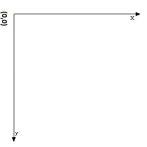

#Brushjs
---
버전 : beta-0.0.1

#시작하기

Brushjs는 HTML5의 canvas 엘리먼트를 통해 2D그래픽 작업을 수월하게 만들어 주는 라이브러리 입니다.

## 설명

###1. 좌표계
기본적으로 canvas엘리먼트의 좌표계는 실게 우리가 이해하는 좌표계와는 다른 형태입니다. 이는 복잡한 그래픽 작업을 하는데 있어서 직관적이지 않은 형태이기에 이를 우리기 이해가기 쉬운 형태로 Brushjs는 내부에서 맞춰주는 작업을 합니다.

**기존 HTML5 Canvas 좌표계**




**Brushjs가 제공하는 좌표계**


###2. 동작방식
포토샵을 한번이라도 사용해본 적이 있으신 분이라면 포토샵이 하나의 이미지를 만들기 위해 Group/layer 라는 구성으로 부분이 모여 하나의 이미지를 만들어 냅니다.

Brushjs도 canvas라는 하나의 엘리먼트를 구성하는 각각의 그래픽 요소들을 Group/layer 형태로 관리를 하고 있습니다.
각각의 layer는 고유한 id값을 가지고 있습니다. id값을 기반으로 우리는 마치 DOM 객체를 다루는 방식과 유사하게 다양한 애니메이션 효과를 만들어 낼 수 있습니다.


###3. 사용법
```html
<!DOCTYPE html>
<html>
<head>
  <meta charset="utf-8">
	<title></title>
</head>
<body>
<canvas id="canvas" width="600" height="300"></canvas>

<script type="text/javascript" src="Brush.js"></script>
<script type="text/javascript">
var canvas = new Brush('canvas');

// Your code

</script>
</body>
</html>
```


##그래픽 요소


**Non-Animation**

1. Line
2. Circle
3. Text
4. Cubic Bézier curve(BezierCurve)
5. Quadratic Bézier curve(QuadraticCurve)
6. ArcTo

**Animation**

1. falling
2. rising
3. blowing
4. bouncing
5. stroking

<br/>
##1.기본 그래픽 (Non-Animation)


####1. Line
-

```javascript
canvas.Line(
  [
    {
      id : 고유한 ID 값(string),
      points : [
        [x0, y0], // 필수 [int, int]
        [x1, y1], // 필수 [int, int]
        ...
        [xn, yn]
      ],
      lineWidth : 라인 두께(string),
      strokeStyle : 라인 칼러(string),
      lineCap : 라인의 끝 마무리 형태,
      lineJoin : 라인간의 연결 형태, //miter , round, bevel
      isClose : 끝점과 시작점 연결 유무 (bool),
      isFill : isClose 가 true인 경우에 내부 색 채움 (bool),
      fillColor : isFill 이 true인 경우 내부 색 (string)
    }
  ]
);
```
#### 예제
```javascript
canvas.Line(
  [
    {
      id : 'line1',
      points : [
        [0, 100],
        [100, 200],
        [200, 180],
        [300, 300],
        [400, 200]
      ],
      lineWidth : 1,
      strokeStyle : 'gray',
      lineCap : 'round',
      lineJoin : 'round', //miter , round, bevel
      isClose : false,
      isFill : true,
      fillColor : 'green'
    }
  ]
);
```


###2. Circle

-
```javascript
canvas.Circle(
  [
    {
      id : 고유한 ID 값(string),
      lineWidth : 라인 두께(string),
      strokeStyle : 라인 칼러(string),
      x : x좌표(int),
      y : y좌표(int),
      startAngle : 시작 각 (int),
      endAngle : 종료 각 (int),
      radius : 반지름(int),
      isFill : 내부 색 채움(bool),
      fillColor : isFill이  true인 경우 내부 색(string)
    }
  ]
)
```
#### 예제
```javascript

var canvas = new Brush('canvas')
canvas.Circle(
  [
    {
      id : 'ball1',
      lineWidth : 1,
      strokeStyle : 'red',
      x : 100,
      y : 100,
      startAngle : 0,
      endAngle : Math.PI*2,
      radius : 20,
      isFill : false,
      fillColor : 'red'
    },
    {
      id : 'ball2',
      lineWidth : 1,
      strokeStyle : 'black',
      x : 320,
      y : 300,
      startAngle : 0,
      endAngle : Math.PI*2,
      radius : 40,
      isFill : true,
      fillColor : 'yellow'
    }
  ]
)

```
###3. Text
-

```javascript
canvas.Text(
  [
    {
      id : 고유한 ID 값(string),
      font : 폰트 속성 (string),
      fillStyle : 폰트 색 (string),
      lineWidth : 폰트 라인 두깨(string),
      strokeStyle : 폰트 라인 색 (string),
      text : 텍스트 (string),
      textAlign : 텍스트 정렬,
      textBaseline : 텍스트 베이스 라인 형태,
      x : x좌표(int),
      y : y좌표(int)
    }
  ]
)
```

####예제

```javascript
canvas.Text(
  [
    {
      id : 'text1',
      font : '38pt Arial',
      fillStyle : 'cornflowerblue',
      lineWidth : 3,
      strokeStyle : 'blue',
      text : 'Hello World',
      textAlign : 'center',
      textBaseline : 'middle',
      x : 200,
      y : 50
    },
    {
      id : 'text2',
      font : '38pt Arial',
      fillStyle : 'cornflowerblue',
      lineWidth : 3,
      strokeStyle : 'blue',
      text : 'Hello World!!!!',
      textAlign : 'left',
      textBaseline : 'middle',
      x : 200,
      y : 150
    }
  ]
)
```

### 4. Cubic Bézier curve(BezierCurve)
-

```javascript
canvas.BezierCurve(
  [
    {
      id : 고유한 ID 값(string),
      from : [x, y], // 시작점 (int)
      points : [
        [controlePointX1, controlePointY1, controlePointX2, controlePointY2, endPointX1, endPointY2]
        ...
      ],
      lineWidth : 폰트 라인 두깨(string),
      strokeStyle : 폰트 라인 색 (string),
      isClose : 끝점과 시작점 연결 유무 (bool),
      isFill : isClose 가 true인 경우에 내부 색 채움 (bool),
      fillColor : isFill 이 true인 경우 내부 색 (string)
    }
  ]
)
```

####예제


```javascript
canvas.BezierCurve(
  [
    {
      id : 'bazier1',
      from : [20, 20],
      points : [
        [20,100,200,100,200,20]
      ],
      lineWidth : 1,
      strokeStyle : 'red',
      isClose : false,
      isFill : true,
      fillColor : 'red'
    }
  ]
)
```
```javascript

canvas.BezierCurve(
  [
    {
      id : 'bazier2',
      from : [170, 80],
      points : [
        [130, 100, 130, 150, 230, 150],
        [250, 180, 320, 180, 340, 150],
        [420, 150, 420, 120, 390, 100],
        [430, 40, 370, 30, 340, 50],
        [320, 5, 250, 20, 250, 50],
        [200, 5, 150, 20, 170, 80]
      ],
      lineWidth : 1,
      strokeStyle : 'red',
      isClose : false,
      isFill : true,
      fillColor : 'red'
    }
  ]
)
```

### 5. Quadratic Bézier curve(QuadraticCurve)
-

```javascript
canvas.QuadraticCurve(
  [
    {
      id : 'quadratic',
      from : [x, y], // 시작점 (int)
      points : [
        [controlePointX1, controlePointY1, endPointX1, endPointY1]
      ],
      lineWidth : 폰트 라인 두깨(string),
      strokeStyle : 폰트 라인 색 (string),
      lineCap : 라인의 끝 마무리 형태,
      isFill : isClose 가 true인 경우에 내부 색 채움 (bool)
    }
  ]
);
```

####예제


````javascript
canvas.QuadraticCurve(
  [
    {
      id : 'quadratic',
      from : [x, y],
      points : [
        [90, 100, 200, 20]
      ],
      lineWidth : 10,
      strokeStyle : 'blue',
      lineCap : 'square',
      isClose : false
    }
  ]
);
````

### 6. ArcTo
-


```javascript
canvas.ArcTo(
  [
    {
      id : 고유한 ID 값(string),
      from : [x, y], // 시작점 (int)
      points : [
        [x1, y1 ,x2, y2, radius]
      ],
      lineWidth : 라인 두께(string),
      strokeStyle : 라인 칼러(string),
      lineCap : 라인의 끝 마무리 형태,
      lineJoin : 라인간의 연결 형태, //miter , round, bevel
      isClose : 끝점과 시작점 연결 유무 (bool),
      isFill : isClose 가 true인 경우에 내부 색 채움 (bool),
      fillColor : isFill 이 true인 경우 내부 색 (string)
    }
  ]
);
```

#### 예제

```javascript
canvas.ArcTo(
  [
    {
      id : 'arc2',
      from : [300, 200],
      points : [
        [350, 200 ,350, 250, 50]
      ],
      lineWidth : 1,
      strokeStyle : 'black',
      lineCap : 'round',
      lineJoin : 'round', //miter , round, bevel
      isClose : false,
      isFill : false,
      fillColor : 'green'
    }
  ]
);
```
<br/><br/><br/>


##2.애니메이션 그래픽 (Animation)

```javascript
canvas.Animation({
	설정값 위치
})
```

###1. falling
-

layer가 아래로 떨어지는 효과

```javascript
{
   id : 효과를 줄 대상 레이어 고유 ID,
   type : 'falling',
   speedX : 좌측 이동 속도,
   speedY : 우측 이동 속도
 }

```
#### 예제

랜덤하게 생성된 10 개의 공이 떨어지는 애니메이션

```javascript
var canvas = new Brush('canvas')
var balls = [];
var animation = [];
for(var i=0; i < 10; i++){
  (function(i){
    var ball = {
      id : 'ball' +i,
      lineWidth : 1,
      strokeStyle :  '#'+Math.floor(Math.random()*16777215).toString(16),
      x : Math.floor(Math.random() * 600) + 1,
      y : Math.floor(Math.random() * 300) + 100,
      startAngle : 0,
      endAngle : Math.PI*2,
      radius : Math.floor(Math.random() * 8) + 3,
      isFill : true,
      fillColor : '#'+Math.floor(Math.random()*16777215).toString(16)
    }
    balls.push(ball);
    var fallingAnimation = {
       id : 'ball' +i,
       type : 'falling',
       speedX : Math.floor(Math.random() * 5) + 1,
       speedY : Math.floor(Math.random() * 2) + 1
     }
     animation.push(fallingAnimation)

  })(i)
}
canvas.Circle(balls)
canvas.Animation(animation)

```

###2. rising
-

layer가 위로 올라가는 효과

```javascript
{
   id : 효과를 줄 대상 레이어 고유 ID,
   type : 'rising',
   speedX : 좌측 이동 속도,
   speedY : 우측 이동 속도
 }

```
#### 예제
랜덤하게 생성된 10 개의 공이 위로 올라가는 애니메이션

```javascript
var canvas = new Brush('canvas')
var balls = [];
var animation = [];
for(var i=0; i < 10; i++){
  (function(i){
    var ball = {
      id : 'ball' +i,
      lineWidth : 1,
      strokeStyle :  '#'+Math.floor(Math.random()*16777215).toString(16),
      x : Math.floor(Math.random() * 600) + 1,
      y : Math.floor(Math.random() * 0),
      startAngle : 0,
      endAngle : Math.PI*2,
      radius : Math.floor(Math.random() * 8) + 3,
      isFill : true,
      fillColor : '#'+Math.floor(Math.random()*16777215).toString(16)
    }
    balls.push(ball);
    var fallingAnimation = {
       id : 'ball' +i,
       type : 'rising',
       speedX : Math.floor(Math.random() * 5) + 1,
       speedY : Math.floor(Math.random() * 2) + 1
     }
     animation.push(fallingAnimation)

  })(i)
}
canvas.Circle(balls)
canvas.Animation(animation)

```
###3. blowing
-
layer가 흩날리는 효과

```javascript
{
   id : 효과를 줄 대상 레이어 고유 ID,
   type : 'rising',
   speedX : 좌측 이동 속도,
   speedY : 우측 이동 속도
 }

```
#### 예제

```javascript
var canvas = new Brush('canvas')
var balls = [];
var animation = [];
for(var i=0; i < 100; i++){
  (function(i){
    var ball = {
      id : 'ball' +i,
      lineWidth : 1,
      strokeStyle :  '#'+Math.floor(Math.random()*16777215).toString(16),
      x : Math.floor(Math.random() * 1000) + 1,
      y : Math.floor(Math.random() * 575) + 500,
      startAngle : 0,
      endAngle : Math.PI*2,
      radius : Math.floor(Math.random() * 5) + 2,
      isFill : true,
      fillColor : '#'+Math.floor(Math.random()*16777215).toString(16)
    }
    balls.push(ball);
    var dir = ['left' ,'right'];
    var fallingAnimation = {
       id : 'ball' +i,
       type : 'blowing',
       dir : dir[ i % 2],
       speed: Math.floor(Math.random() * 2) + 1
     }
     animation.push(fallingAnimation)

  })(i)
}
canvas.Circle(balls)
canvas.Animation(animation)
```

###4. bouncing
-
layer가 해당 canvas내에서 부딫혀 튕기는 효과

```javascript
{
   id : 효과를 줄 대상 레이어 고유 ID,
   type : 'rising',
   speedX : 좌측 이동 속도,
   speedY : 우측 이동 속도
 }

```
#### 예제

```javascript
var canvas = new Brush('canvas')
var balls = [];
var animation = [];
for(var i=0; i < 10; i++){
  (function(i){
    var ball = {
      id : 'ball' +i,
      lineWidth : 1,
      strokeStyle :  '#'+Math.floor(Math.random()*16777215).toString(16),
      x : Math.floor(Math.random() * 600) + 1,
      y : Math.floor(Math.random() * 300),
      startAngle : 0,
      endAngle : Math.PI*2,
      radius : Math.floor(Math.random() * 8) + 3,
      isFill : true,
      fillColor : '#'+Math.floor(Math.random()*16777215).toString(16)
    }
    balls.push(ball);
    var fallingAnimation = {
       id : 'ball' +i,
       type : 'bouncing',
       speedX : Math.floor(Math.random() * 5) + 1,
       speedY : Math.floor(Math.random() * 2) + 1
     }
     animation.push(fallingAnimation)

  })(i)
}
canvas.Circle(balls)
canvas.Animation(animation)
```

###5. stroking
-
주어진 좌표를 따라 선을 긋는 효과

```javascript

canvas.Stroke([
  {
    id : 고유한 ID 값(string),
    points: [
      [startX, startY],
      [x1, x2],
      ...
      [xn, yn]
    ]
  }
]);
canvas.Animation([
  {
    id : 효과를 줄 대상 레이어 고유 ID,
    type: 'stroking',
    speed: 선을 긋는 속도(int)
  }
])

```

####예제
```javascript

canvas.Stroke([
  {
    id: 'stroke',
    points: [
      [0, 100],
      [100, 150],
      [300, 70],
      [400, 180],
      [500, 100],
      [600, 40]
    ]
  }
]);
canvas.Animation([
  {
    id: 'stroke',
    type: 'stroking',
    speed: 1,
    time: 1
  }
])

```
