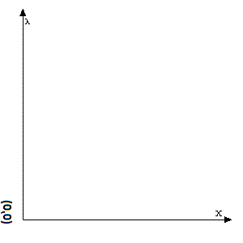

# Brushjs


# 둘러보기

**[Brushjs Gallery](http://yuby.github.io/brushjs/)**

# 시작하기

Brushjs는 HTML5의 canvas 엘리먼트를 통해 2D그래픽 작업을 수월하게 만들어 주는 라이브러리 입니다.

## 설명

### 1. 좌표계
기본적으로 canvas엘리먼트의 좌표계는 실게 우리가 이해하는 좌표계와는 다른 형태입니다. 이는 복잡한 그래픽 작업을 하는데 있어서 직관적이지 않은 형태이기에 이를 우리기 이해가기 쉬운 형태로 Brushjs는 내부에서 맞춰주는 작업을 합니다.

**기존 HTML5 Canvas 좌표계**


**Brushjs가 제공하는 좌표계**




### 2. 동작방식
Brushjs도 canvas라는 하나의 엘리먼트를 구성하는 각각의 그래픽 요소들을 고유한 id값을  기반으로 관리 되고 있습니다. 이는 마치 DOM 객체를 다루는 방식과 유사하게 다양한 그래픽 효과나 애니메이션 효과를 만들 수 있습니다.


### 3. 사용법
```html
<!DOCTYPE html>
<html>
<head>
  <meta charset="utf-8">
  <title></title>
</head>
<body>
<canvas id="canvas" width="600" height="300"></canvas>

<script type="text/javascript" src="Brush.js"></script>
<script type="text/javascript">
var canvas = new Brush('canvas');

// Your code

</script>
</body>
</html>
```

<br/>
#### - 기본 메서드
<br/>
##### set(element_info)
set 메서드의 인자로 전달된 정보는 new 를 통해 생성된 인스턴스에 레이어 정보로 추가가 됩니다.
```javascript
var circle = {
  ... info
}
canvas.set(circle)

```
<br/>
##### draw()
set을 통해 저장된 레이어를 canvas상에 그리는 역활을 합니다. draw 메서드가 호출되기 전에는 set으로 저장한 레이어를 그리지는 않습니다.
```javascript

canvas.draw()

```
<br/>
##### get(layer_id)
get 메서드는 set을 통해 저장된 레이어의 고유 아이디를 기반으로 해당 레이어 정보를 전달받습니다.
```javascript

canvas.get(id)

```
<br/>
##### getLayers()
getLayers 메서드는 set을 통해 저장된 전체 레이어 정보를 전달받습니다.
```javascript

canvas.getLayers()
```
<br/>
##### delete(layer_id)
delete 메서드는 set을 통해 저장된 레이어 정보를 삭제합니다.
```javascript

canvas.delete(id)

```
<br/>
##### clear()
clear 메서드는 해당 canvas 영역을 모두 지웁니다.
```javascript

canvas.clear()

```
<br/><br/>
#### - 애니메이션 메서드
<br/>
##### animate(elements_info)
animate 메서드는 애니메이션 효과를 줄 레이어 정보를 설정합니다.
```javascript
var moving = {
  // moving animation
}
canvas.animate(moving)

```
<br/>
##### deleteAnimation(layer_id)
deleteAnimation 메서드는 animate 메서드를 통해 등록된 에니메이션 정보를 제거합니다.
```javascript

canvas.deleteAnimation(id)

```
<br/>
##### start()
animate 메서드를 통해 등록된 에니메이션 정보로 애니메이션을 시작합니다.
```javascript

canvas.start()

```

<br/><br/>
#### - 이벤트 메서드
<br/>
##### click(callback)
클릭시 필요한 행동을 callback 함수로 전달합니다.
```javascript
var callbackFn = function(){
  //....
}

canvas.click(callbackFn)

```
<br/>
##### mousemove(callback)
canvas 상에서 마우스를 이동 시킬때 필요한 행동을 callback 함수로 전달합니다.
```javascript
var callbackFn = function(){
  //....
}

canvas.mousemove(callbackFn)

```


<br/><br/>
### 4.기본 그래픽 (Non-Animation)

<br/>
#### Line
-

```javascript
var line = {
  id : 고유한 ID 값(string),
  type: 'line',
  points : [
    [x0, y0], // 필수 [int, int]
    [x1, y1], // 필수 [int, int]
    ...
    [xn, yn]
  ],
  lineWidth : 라인 두께(string),
  strokeStyle : 라인 칼러(string),
  lineCap : 라인의 끝 마무리 형태,
  lineJoin : 라인간의 연결 형태, //miter , round, bevel
  isClose : 끝점과 시작점 연결 유무 (bool),
  isFill : isClose 가 true인 경우에 내부 색 채움 (bool),
  fillStyle : isFill 이 true인 경우 내부 색 (string),
  opacity : 투명도 (0 < opacity < 1)
};

```
<br/>
#### 예제
```javascript
var line = {
  id : 'line1',
  type: 'line',
  from : [0, 100],
  points : [
    [100, 200],
    [200, 180],
    [300, 300],
    [400, 200],
    [600, 0]
  ],
  lineWidth : 1,
  strokeStyle : 'gray',
  lineCap : 'round',
  lineJoin : 'round',
  isClose : false,
  isFill : false,
  fillStyle : 'green',
  opacity : 0.5
}
canvas.set([
  line
]).draw();
```

<br/>
#### MutiLine
-

```javascript
var MutiLine = {
  id : 고유한 ID 값(string),
   type: 'mutiLine',
  type: 'line',
  points : [
    [x0, y0], // 필수 [int, int]
    [x1, y1], // 필수 [int, int]
    ...
    [xn, yn]
  ],
  lineWidth : 라인 두께(string),
  strokeStyle : 라인 칼러(string),
  lineCap : 라인의 끝 마무리 형태,
  lineJoin : 라인간의 연결 형태, //miter , round, bevel
  isClose : 끝점과 시작점 연결 유무 (bool),
  isFill : isClose 가 true인 경우에 내부 색 채움 (bool),
  fillStyle : isFill 이 true인 경우 내부 색 (string),
  opacity : 투명도 (0 < opacity < 1)
};
```
<br/>
#### 예제
```javascript
var multiLine = {
  id: 'multiLine',
  type: 'mutiLine',
  from:  [0, 100],
  lines : [
    {
      type : 'line',
      points: [
        [10, 100]
        ]
    },
    {
      type : 'quadraticCurve',
      points : [
        [110, 118, 210, 100]
      ]
    },
    {
      type : 'line',
      points: [
        [230, 100]
        ]
    },
    {
      type : 'quadraticCurve',
      points : [
        [330, 118, 430, 100]
      ]
    },
    {
      type : 'line',
      points: [
        [430, 120],
        [0 ,120]
        ]
    },

  ],
  lineWidth : 3,
  strokeStyle : '#000',
  lineCap : 'round',
  lineJoin : 'round',
  isFill : false,
  fillStyle: 'red'
}
canvas.set([
  multiLine
]).draw();
```

<br/>
#### Circle

-
```javascript
var circle = {
  id : 고유한 ID 값(string),
  type: 'circle',
  points : [
      [x1 , y1 , radius1],
      ...
      [x , y , radius]
  ]
  startAngle : 시작 각 (int),
  endAngle : 종료 각 (int),
  radius : 반지름(int),
  lineWidth : 라인 두께(string),
  strokeStyle : 라인 칼러(string),
  isFill : 내부 색 채움(bool),
  fillStyle : isFill이  true인 경우 내부 색(string),
  opacity : 투명도 (0 < opacity < 1)
}
```
<br/>
#### 예제
```javascript
var circle = {
  id : 'ball1',
  type: 'circle',
  points : [
      [100, 100 , 20]
  ],
  startAngle : 0,
  endAngle : Math.PI*2,
  radius : 20,
  lineWidth : 1,
  strokeStyle : 'red',
  isFill : true,
  fillStyle : 'red'
}
canvas.set([
  circle
]).draw();
```
<br/>
#### Rectangle
-
```javascript
var rectangle ={
  id : 고유한 ID 값(string),
  type: 'rectangle',
  points :
  [
    [x1, y1, width1, height1],
    ...
    [x, y, width, height]
  ],
  lineWidth : 라인 두께(string),
  strokeStyle : 라인 칼러(string),
  isFill : 내부 색 채움(bool),
  fillStyle : isFill이  true인 경우 내부 색(string),
  opacity : 투명도 (0 < opacity < 1)
}
```
<br/>
#### 예제
```javascript
var  rectangle = {
  id: 'rectangle',
  type: 'rectangle',
  points :
    [
      [50, 50, 100, 100]
    ],
  isFill : true,
  fillStyle : 'red',
  lineWidth : 1,
  strokeStyle : 'gray',
  opacity : 1,
   fillStyle : 'red'
}
canvas.set([
  rectangle
]).draw();
```
<br/>
#### Text
-

```javascript
var text = {
  id : 고유한 ID 값(string),
  type: 'text',
  points : [
  [x , y],
  ...
  ],
  text : 텍스트 (string),
  font : 폰트 속성 (string),
  textAlign : 텍스트 정렬,
  textBaseline : 텍스트 베이스 라인 형태,
  fillStyle : 폰트 색 (string),
  lineWidth : 폰트 라인 두깨(string),
  strokeStyle : 폰트 라인 색 (string),
  opacity : 투명도 (0 < opacity < 1)
}
```
<br/>
#### 예제

```javascript
var text ={
  id : 'text1',
  type: 'text',
  font : '38pt Arial',
  fillStyle : 'yellow',
  lineWidth : 1,
  //strokeStyle : 'blue',
  text : 'Hello World',
  textAlign : 'center',
  textBaseline : 'middle',
  points : [
    [200 , 50],
    [300 , 150]
  ]
}
canvas.set([
  text
]).draw();
```
<br/>
#### Cubic Bézier curve(BezierCurve)
-

```javascript
var bezierCurve = {
  id : 고유한 ID 값(string),
  type: 'bezierCurve',
  from : [x, y], // 시작점 (int)
  points : [
    [controlePointX1, controlePointY1, controlePointX2, controlePointY2, endPointX1, endPointY2]
    ...
  ],
  lineWidth : 폰트 라인 두깨(string),
  strokeStyle : 폰트 라인 색 (string),
  isClose : 끝점과 시작점 연결 유무 (bool),
  isFill : isClose 가 true인 경우에 내부 색 채움 (bool),
  fillStyle : isFill 이 true인 경우 내부 색 (string),
  opacity : 투명도 (0 < opacity < 1)
}
```
<br/>
#### 예제


```javascript
var bezierCurve ={
  id : 'bazier1',
  type: 'bezierCurve',
  from : [20, 20],
  points : [
    [20,100,200,100,200,20]
  ],
  lineWidth : 3,
  strokeStyle : 'green',
  isClose : false,
  isFill : false,
  fillStyle : 'red'
}
canvas.set([
  bezierCurve
]).draw();
```

<br/>
#### Quadratic Bézier curve(QuadraticCurve)
-

```javascript
var quadraticCurve ={
  id : 'quadratic',
  type: 'quadraticCurve',
  from : [x, y], // 시작점 (int)
  points : [
    [controlePointX1, controlePointY1, endPointX1, endPointY1]
  ],
  lineWidth : 폰트 라인 두깨(string),
  strokeStyle : 폰트 라인 색 (string),
  lineCap : 라인의 끝 마무리 형태,
  isFill : isClose 가 true인 경우에 내부 색 채움 (bool),
  opacity : 투명도 (0 < opacity < 1)
}
```

####예제


````javascript
var quadraticCurve ={
  id : 'quadratic',
  type: 'quadraticCurve',
  from : [20, 20],
  points : [
    [20, 100, 200, 20]
  ],
  lineWidth : 10,
  strokeStyle : 'blue',
  lineCap : 'square',
  isClose : false
}
canvas.set([
  quadraticCurve
]).draw();
````

#### ArcTo
-


```javascript
var arcTo = {
  id : 고유한 ID 값(string),
  type: 'arcTo',
  from : [x, y], // 시작점 (int)
  points : [
    [x1, y1 ,x2, y2, radius]
  ],
  lineWidth : 라인 두께(string),
  strokeStyle : 라인 칼러(string),
  lineCap : 라인의 끝 마무리 형태,
  lineJoin : 라인간의 연결 형태, //miter , round, bevel
  isClose : 끝점과 시작점 연결 유무 (bool),
  isFill : isClose 가 true인 경우에 내부 색 채움 (bool),
  fillStyle : isFill 이 true인 경우 내부 색 (string),
  opacity : 투명도 (0 < opacity < 1)
}
```

#### 예제

```javascript
var arcTo = {
  id : 'arc2',
  type: 'arcTo',
  from : [300, 200],
  points : [
    [350, 200 ,350, 250, 50]
  ],
  lineWidth : 2,
  strokeStyle : 'black',
  lineCap : 'round',
  lineJoin : 'round', //miter , round, bevel
  isClose : false,
  isFill : false
}
canvas.set([
  arcTo
]).draw();
```
<br/><br/><br/>

### 5.애니메이션 그래픽 (Animation)

```javascript
canvas.animate([
  {
    id: '고유한 ID 값(string),
    type: 'stroking', // moving
    speed: 1, // how fast
    time: 1 // how many
  }
]);
```
<br/>
#### Stroking
-


```javascript
var stroke =
    {
      id : 'stroke1',
      type: 'stroke',
      points : [
        [0, 100],
        [100, 200],
        [200, 180],
        [300, 300],
        [400, 200],
        [600, 0]
      ],
      lineWidth : 1,
      strokeStyle : '#000',
      lineCap : 'round',
      lineJoin : 'round'
    }
canvas.set([
  stroke
]).draw().animate([
  {
    id: 'stroke1',
    type: 'stroking',
    speed: 1,
    time: 1
  }
]).start();

```
<br/>
#### Moving
-


```javascript
var multiLine = {
  id: 'multiLine',
  type: 'mutiLine',
  from:  [0, 100],
  lines : [
    {
      type : 'line',
      points: [
        [10, 100]
        ]
    },
    {
      type : 'quadraticCurve',
      points : [
        [110, 118, 210, 100]
      ]
    },
    {
      type : 'line',
      points: [
        [230, 100]
        ]
    }
  ],
  lineWidth : 3,
  strokeStyle : '#000',
  lineCap : 'round',
  lineJoin : 'round',
  isFill : false,
  fillStyle: 'red'
}
canvas.set([
  multiLine
]).draw();

var circle = {
  id : 'ball1',
  type: 'circle',
  points : [
      [100, 100 , 20]
  ],
  startAngle : 0,
  endAngle : Math.PI*2,
  radius : 20,
  lineWidth : 1,
  strokeStyle : 'red',
  isFill : true,
  fillStyle : 'red'
}
canvas.set([
  circle,
  multiLine

]).draw().animate([
  {
    id: 'ball1',
    type: 'moving',
    moveTo : [200, 200],
    speed: 1,
    time: 2
  },
 {
    id: 'multiLine',
    type: 'moving',
    moveTo : [200, 200],
    speed: 1,
    time: 2
  }
]).start();

```

<br/><br/><br/>

### 6.이벤트

<br/>
#### Click
```javascript
var circle = {
  id : 'ball1',
  type: 'circle',
  points : [
      [100, 100 , 20]
  ],
  startAngle : 0,
  endAngle : Math.PI*2,
  radius : 20,
  lineWidth : 1,
  strokeStyle : 'red',
  isFill : true,
  fillStyle : 'red'
}


var clickEvent = function(self , position){
  canvas.get('ball1').points.forEach(function(elem){
    elem[0] = position.x;
    elem[1] = position.y;
    self.draw()
  })
}
canvas.set([
  circle
]).draw().click(clickEvent);
```

<br/>
#### Mousemove

```javascript
var circle = {
  id : 'ball1',
  type: 'circle',
  points : [
      [100, 100 , 20]
  ],
  startAngle : 0,
  endAngle : Math.PI*2,
  radius : 20,
  lineWidth : 1,
  strokeStyle : 'red',
  isFill : true,
  fillStyle : 'red'
}


var clickEvent = function(self , position){
  canvas.get('ball1').points.forEach(function(elem){
    elem[0] = position.x;
    elem[1] = position.y;
    self.draw()
  })
}
canvas.set([
  circle
]).draw().mousemove(clickEvent);
```

---
# What Next

1. <del>Rectangle</del> (updated 2016.07.13)
2. <del>Gradient(effect)</del> (updated 2016.07.15)
3. <del>Shadow(effect)</del> (updated 2016.07.15)
4. <del>globalCompositeOperation</del> (updated 2016.07.19)
5. Scale(animation)
6. Rotate(animation)
7. <del>moving to specific points (animation)<del> (updated 2016.09.01)
8. Image
9. Performance
10. Document in English
11. [Brushjs Gallery](yuby.github.io/brushjs/) (updating)


